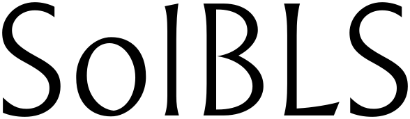

# solbls



[![Github Actions][gha-badge]][gha]
[![Foundry][foundry-badge]][foundry]
[![License: MIT][license-badge]][license]
[](https://codecov.io/gh/warlock-labs/solbls)
[](https://github.com/RichardLitt/standard-readme)

A Solidity library for efficient BLS signature verification over the alt-bn128 curve, optimized for on-chain
verification.

## Table of Contents

- [Background](#background)
- [Features](#features)
- [Usage](#usage)
- [Security](#security)
- [Install](#install)
- [API](#api)
- [Testing](#testing)
- [Benchmarks](#benchmarks)
- [Versioning](#versioning)
- [Maintainers](#maintainers)
- [Contributing](#contributing)
- [Support](#support)
- [Changelog](#changelog)
- [License](#license)

## Background

This library implements BLS over the alt-bn128 curve in Solidity. SolBLS performs well,
according to [RFC 9380](https://datatracker.ietf.org/doc/html/rfc9380).
It implements the recommended `expand_msg_xmd` algorithm for hashing a bytestring to an element of
the field, and likewise hashing a bytestring to a pair of elements in the field. To convert these
field elements to curve elements, it implements the Shallue-van de Woestijne encoding, which is
constant time and relatively economical to execute on-chain.

It's meant primarily for on-chain verification of signed messages produced by [Sylow](https://github.com/warlock-labs/sylow),
for use in [Warlock](https://warlock.xyz)'s data feeds.

It's an amalgamation of several repositories, all of which seem to be based
on [this article](https://ethresear.ch/t/bls-signatures-in-solidity/7919).
The library here is based upon [kevincharm](https://github.com/kevincharm/bls-bn254/tree/master)'s version, but actually
this
exists in many versions:

- https://gist.github.com/kobigurk/257c1783ddf556e330f31ed57febc1d9
- https://github.com/ralexstokes/deposit-verifier/blob/8da90a8f6fc686ab97506fd0d84568308b72f133/deposit_verifier.sol
- https://github.com/kilic/evmbls/blob/master/contracts/BLS.sol
- https://github.com/thehubbleproject/hubble-contracts

## Features

- Efficient implementation of BLS signatures
- Compliant with RFC 9380
- Optimized for on-chain execution
- Implements Shallue-van de Woestijne encoding for constant-time operations
- Supports single signature verification

## Usage

Import the BLS library in your Solidity contract:

```solidity
import "solbls/BLS.sol";
```

Example usage:

```solidity
contract MyContract {
    using BLS for *;

    function verifySignature(
        uint256[2] memory signature,
        uint256[4] memory pubkey,
        uint256[2] memory message
    ) public view returns (bool) {
        // First, check if the signature and public key are valid
        require(BLS.isValidSignature(signature), "Invalid signature");
        require(BLS.isValidPublicKey(pubkey), "Invalid public key");

        // Hash the message to a point on the curve
        uint256[2] memory hashedMessage = BLS.hashToPoint("domain", abi.encodePacked(message));

        // Verify the signature
        return BLS.verifySingle(signature, pubkey, hashedMessage);
    }
}
```

For more detailed usage examples, please refer to the test files in the `test/` directory.

## Security

This version of the contract does not implement point compression or subgroup membership checks. While relatively safe
on BN254, the reliance on the pre-compile to catch malformed keys may or may not have been intentional from the original
Solidity implementation.

Key security considerations:

- Lack of explicit subgroup membership checks could potentially introduce vulnerabilities in certain scenarios.
- The library relies on precompiles for key validation, which may have implications for gas costs and security.

For more details on security considerations, please refer to the `audits` folder.

## Install

This module depends on [Foundry](https://getfoundry.sh/). Make sure you have it installed before proceeding.

```bash
forge install warlock-labs/solbls
```

## API

The main functions provided by the BLS library include:

- `verifySingle`: Verify a single BLS signature
- `hashToPoint`: Hash a message to a point on the BN254 G1 curve
- `isValidSignature`: Check if a given signature is valid
- `isValidPublicKey`: Check if a given public key is valid

For detailed API documentation, please refer to the comments in the `BLS.sol` file.

## Testing

To run the tests for solbls, use the following command:

```bash
forge test
```

The tests cover various aspects of the library, including signature verification, point hashing, and input validation.
For a detailed breakdown of test coverage, please refer to the `test/` directory.

## Versioning

solbls follows Semantic Versioning. For the versions available, see
the [tags on this repository](https://github.com/warlock-labs/solbls/tags).

## Maintainers

This project is maintained by:

- [@trbritt](https://github.com/trbritt)
- [@individualWhoCodes](https://github.com/individualWhoCodes)
- [@0xAlcibiades](https://github.com/0xAlcibiades)

## Contributing

We welcome contributions to solbls! Please follow these steps to contribute:

1. Fork the repository
2. Create your feature branch (`git checkout -b feature/AmazingFeature`)
3. Commit your changes (`git commit -m 'Add some AmazingFeature'`)
4. Push to the branch (`git push origin feature/AmazingFeature`)
5. Open a Pull Request

Please make sure to update tests as appropriate and adhere to
the [Solidity style guide](https://docs.soliditylang.org/en/v0.8.17/style-guide.html).

## Support

For support, please open an issue in the GitHub repository or reach out to the maintainers directly.

## Changelog

For a detailed list of changes and version history, please refer to the [CHANGELOG.md](CHANGELOG.md) file.

## License

[MIT](LICENSE) © 2024 Warlock Labs

[gha]: https://github.com/warlock-labs/solbls/actions

[gha-badge]: https://github.com/warlock-labs/solbls/actions/workflows/CI.yml/badge.svg

[foundry]: https://getfoundry.sh/

[foundry-badge]: https://img.shields.io/badge/Built%20with-Foundry-FFDB1C.svg

[license]: https://opensource.org/licenses/MIT

[license-badge]: https://img.shields.io/badge/License-MIT-blue.svg